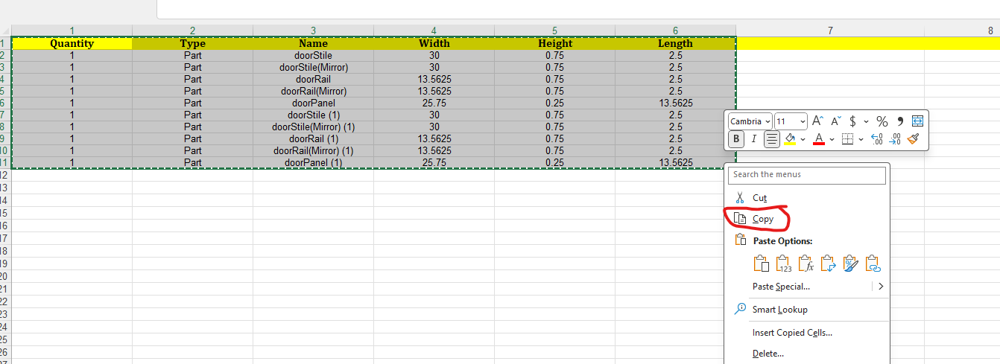

# openbom-parser

Steps to run

before exporting, **change values from fraction to decimal and remove any assemply types**

export excel sheet of parts from openbom only of Type Part

remove irrelavent rows and columns

navigate to developer tab and click visual basic option

click on sheet under VBAProject->Microsoft Excel Objects->Sheet
Then click on File->Import-> select heigh-length-swap.bas file from this project
a new modules folder should be created with the script imported

click on green button to run script, this should put all the smallest values in the height section

export file as csv

# Steps to import into cutlist FX
Copy CSV formatted table into clip board

open cutlist FX

under Edit drop down menu, click on `Import parts from clipboard`

map the the csv headers to the cutlist fields, then hit finish

make sure to add material type once everything is imported!